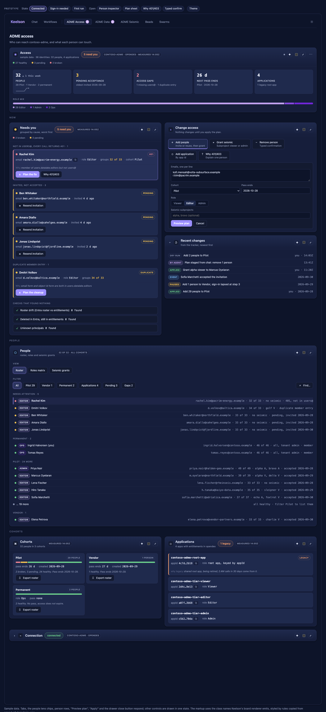

# @keelson/rib-adme

A [keelson](https://github.com/danielscholl/keelson) rib for administering an
[Azure Data Manager for Energy](https://learn.microsoft.com/azure/energy-data-services/)
(ADME) instance: who has access, what data is in it, and who can reach each
seismic subproject.

**Status: first take built.** All three sections work against a live
instance: Access and Data read-only, and Seismic with every change made
through a previewed plan. Applying plans to a real instance is the part still
being proven.

## What the first take covers

One ADME tab. Its header picks one of three sections and carries the
connection: the instance, who is signed in with their role, and Connection
details.

- **Access.** People and applications: who needs attention and why, every
  person against roles and seismic grants, and who uses the instance.
- **Data.** Read-only: how many records each family, authority or schema
  version holds, which legal tags need a look and the records that carry them,
  a record search with a detail drawer, and which services answer.
- **Seismic.** Seismic subprojects with their members by name, and granting
  or revoking a person's access.

The rib works from the operator's Azure CLI sign-in and stores no secret. Every
change is a dry-run plan first; nothing is written until the plan is applied.

The rib is built around one instance and the way it is run: cohorts of people
from partner organizations, a roster group, and seismic subprojects granted per
person. Connecting is a one-time setup that records that instance's profile.
Another ADME instance run differently may not fit, and multiple instances are
not planned.

## Install

```sh
keelson rib add github:danielscholl/keelson-rib-adme
keelson restart
```

Then sign in to the tenant that holds the instance and open the ADME tab:

```sh
az login --tenant <tenant id>
```

The first-run journey lists the ADME instances that sign-in can see in Azure,
across every subscription. Connect on one saves its host, partition, tenant
id and ADME app id as the profile; none of them is secret. Without an Azure
role on the instance, enter them by hand. Test connection makes about eight
read-only calls, reads the entitlements domain from the instance and records
what this sign-in can do. A missing capability disables the feature that needs it.

## How it reaches the instance

The rib runs inside the Keelson server. Before each batch of calls it asks
`az account get-access-token` for a token for the ADME app id and for Microsoft
Graph, scoped to the profile's tenant, and calls the ADME services and Graph
directly. When the sign-in lapses, every section says "sign-in needed", keeps
showing the last sweep, and pauses changes until `az login` and Re-test.

Reads are tiered so that opening a section is cheap: the last sweep is cached in
the rib's data directory (`~/.keelson/rib-adme`), a sweep runs on Refresh now
and after Re-test, and a timer refreshes only within 15 minutes of the last
action.

## What to know before using it

- Names, email addresses and object ids appear as plain text in board frames
  and in the rib's data directory. That suits a single operator on a local
  workbench; don't run it on a shared host.
- Selection, including the section, is held by the rib, not per browser
  window: two windows share one drawer target and one view.

## Develop

```sh
bun install
bun test && bun run typecheck && bun run check
keelson rib add "$PWD" && keelson restart
```

## Design

- [design/README.md](design/README.md): the design document.
- [design/adme-access-desk.html](design/adme-access-desk.html): the interactive
  mockup. Download it and open it in a browser. It draws the three tabs and the
  inspectors with the markup and styles Keelson's board renderer uses, on
  sample data.
- [design/spec.md](design/spec.md): the screen-by-screen specification the
  mockup is built from.



## License

Apache-2.0. See [LICENSE](LICENSE) and [NOTICE](NOTICE).
