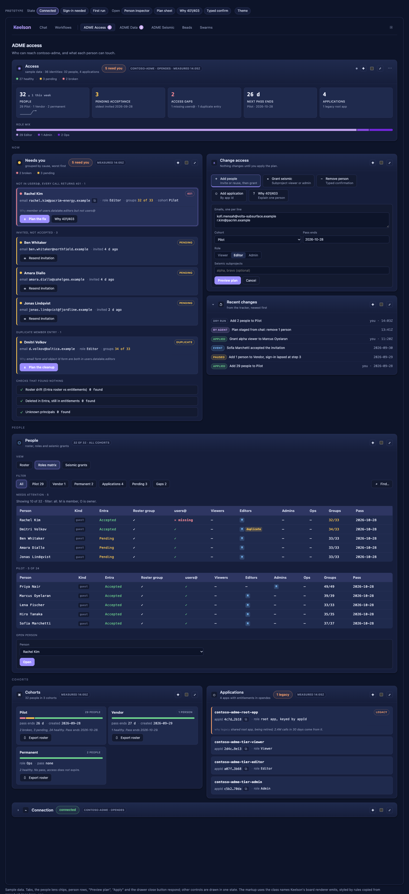
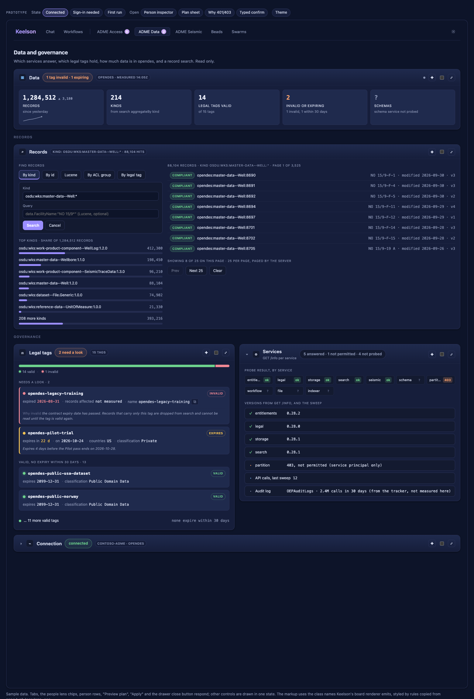
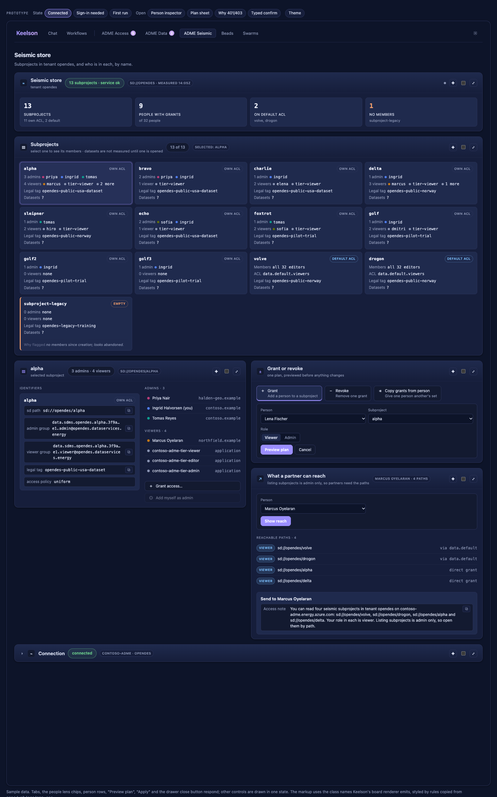
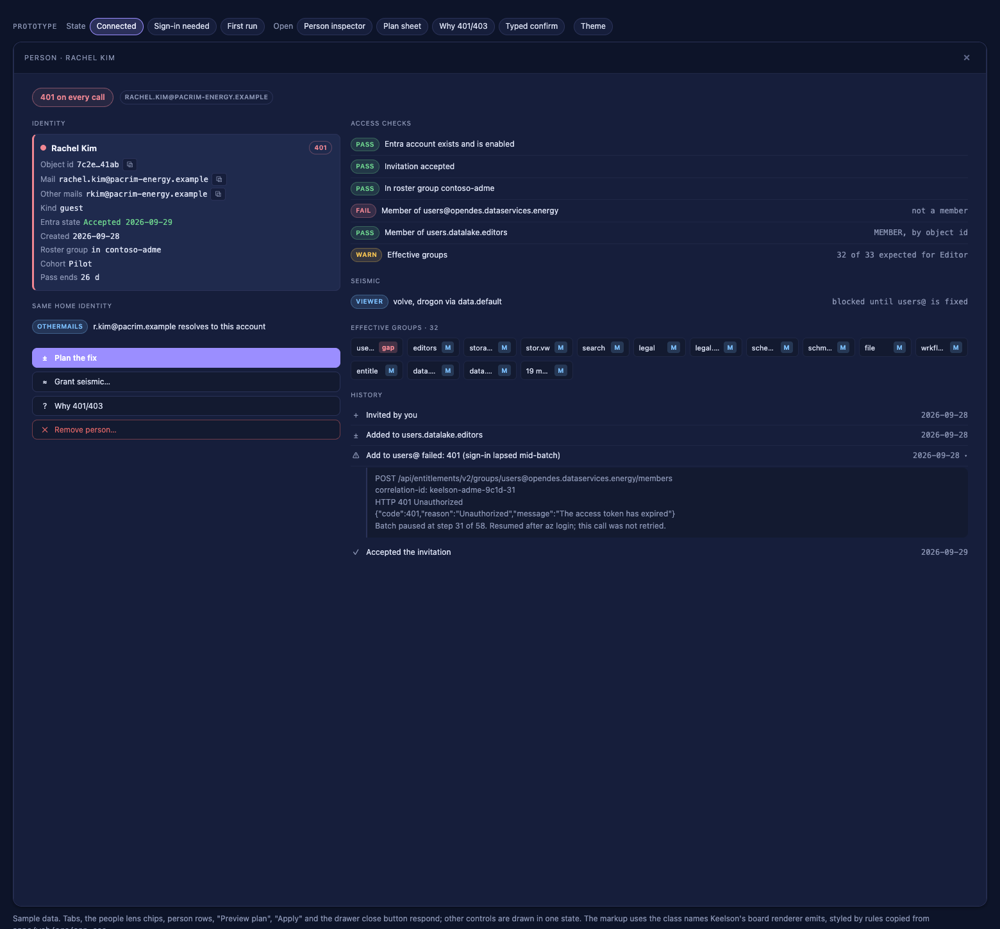
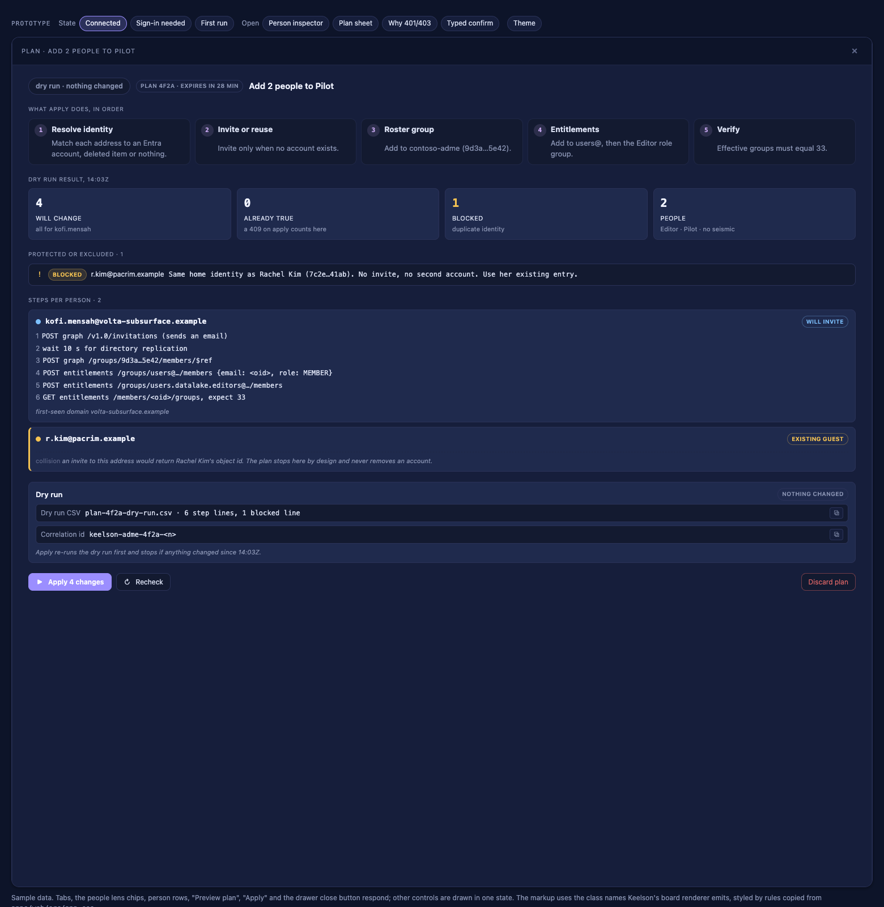
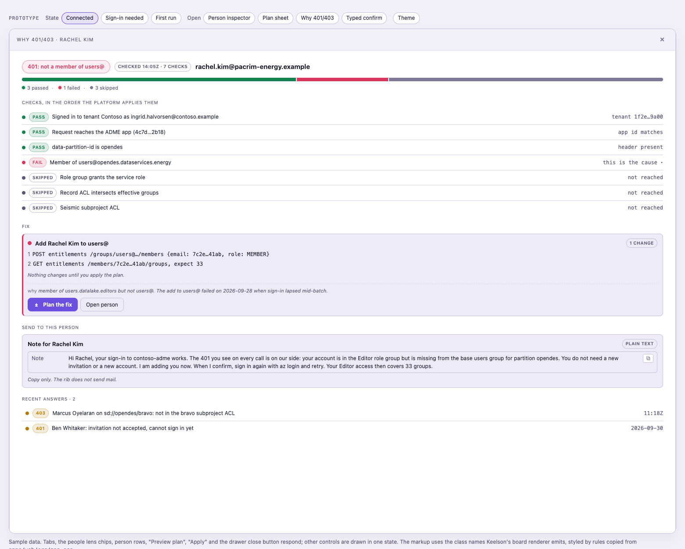
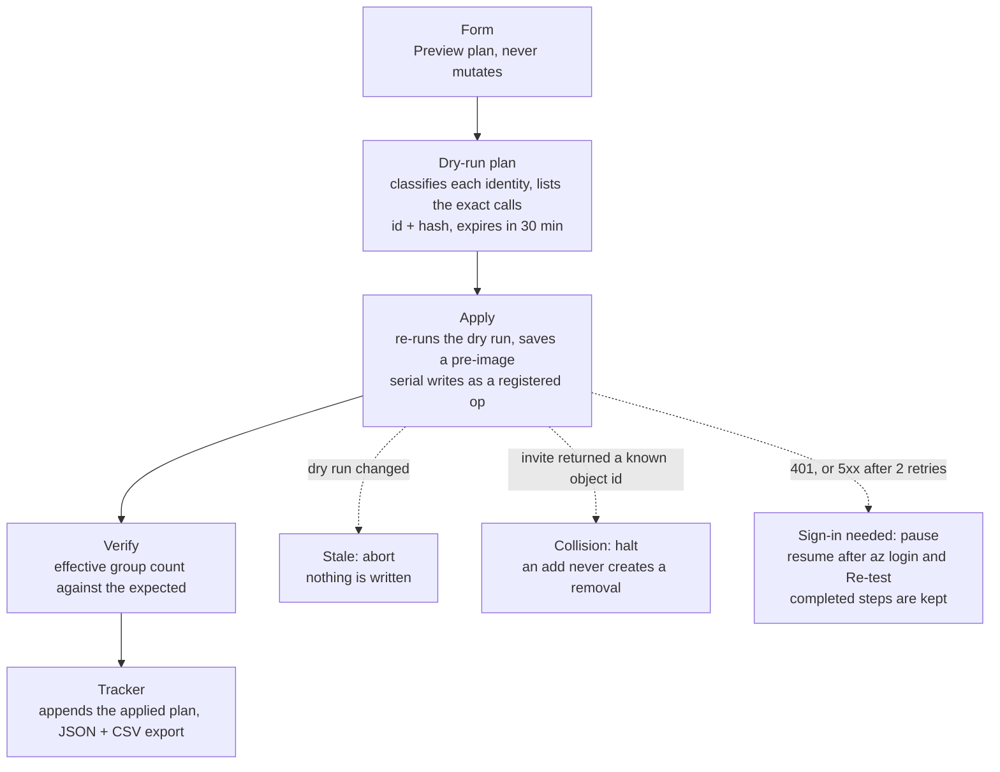
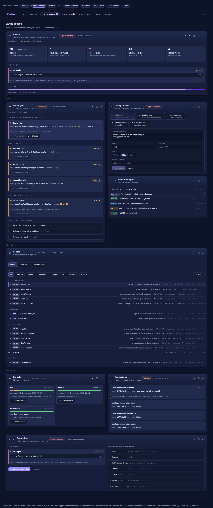
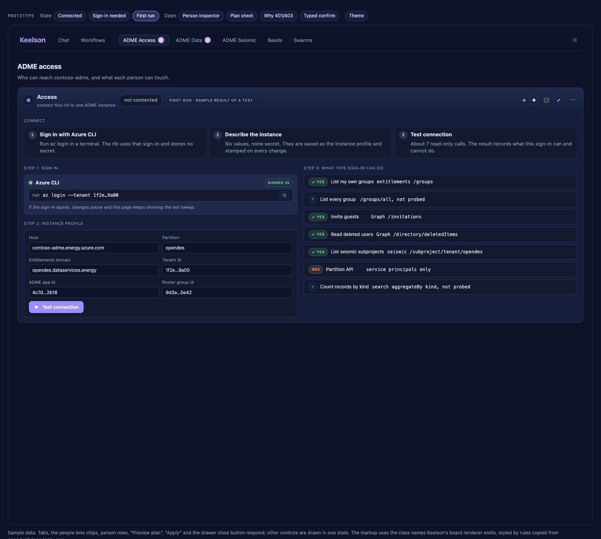
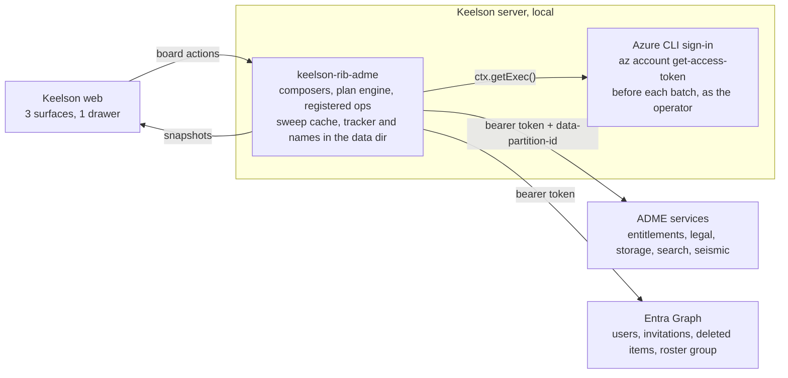

# ADME rib design

A Keelson rib that gives one operator an admin surface for an Azure Data Manager for Energy (ADME) instance: who has access, what data is there, and who is in each seismic subproject.

**Today.** An ADME instance is typically run with ad hoc scripts, `az` and Graph calls, and a tracker kept by hand. An invitation to a new address can resolve to an existing guest and return that guest's object id; acting on that mistaken identity can strip access from the wrong person. Seismic access sits in groups named by UUID (`data.sdms.opendes.alpha.3f9a…e1.admin`), acceptance state lives only in Graph, and no batch change has a dry run.

**The rib.** Three tabs. The ADME Access tab lists who needs attention and why, shows every person against roles and seismic grants by name, and routes every write through one plan: a form produces a dry run, the plan sheet classifies each identity before any invitation, and Apply re-checks, writes serially, verifies the effective group count and appends to a tracker. The rib works from the operator's Azure CLI sign-in, so it holds no secret.

**Limits.** This is a design. Nothing is built and nothing was called live. Every name, count and id here and in the mockup is sample data. Shelling `az` from the rib through `ctx.getExec()` is unverified, and the whole design rests on it. The identity collision can be detected and halted, not prevented, once an invitation email is sent. ADME Data is read-only in the first take.

The interactive companion is [adme-access-desk.html](adme-access-desk.html). The working notes behind it, including the canonical sample data, are in [spec.md](spec.md).

## Scope of the first take

The sample instance has 36 identities (32 people and 4 applications) and 13 seismic subprojects. "Applications" is the UI word for service principals.

| Tab | Scope | Badge in the sample |
|---|---|---|
| ADME Access | Managing people and applications. | 5 (3 pending, 2 broken) |
| ADME Data | Whether each service can be reached, legal tags, how much data is in the system, and record search. Read-only. | 2 (1 invalid tag, 1 expiring) |
| ADME Seismic | Seismic subprojects: who is in each by name, grant and revoke. | none |

The tab labels carry the rib name because the top bar has no overflow rule and other ribs sit beside them. A Connection region is the footer of all three tabs.

Out of the first take: creating, extending or deleting legal tags, removing a whole cohort, agent tools, and everything under [Later and Not planned yet](#build-order).

## ADME Access


Question it answers: who has access, are they using it, and who do I need to follow up with? The tab is a viewer: nothing on it changes access.

| Region | Key | What it holds |
|---|---|---|
| Access | `rib:adme:pulse` | Status "N to follow up"; an adoption strip in the access guide's words (Invited, Not used, Idle, Active); one sentence that says it all; 5 tiles (People with organizations and role mix, Active this week with a spark, Not accepted, Accepted not used, Access gaps). The tab badge counts the same N. |
| Follow up | `rib:adme:attention` | Rows, oldest first: who cannot use it (401, duplicate entry), who has not accepted, who accepted but made no data call in the log. Rows open the person; nothing here changes the instance. Then the checks that found nothing. |
| Activity | `rib:adme:activity` | People who made a data call per day, and calls by organization, over 14 days, from the audit log. Offers "Find the audit log" when no workspace is set. |
| Organizations | `rib:adme:orgs` | One card per email domain with everyone named in their usage tone and a usage bar. Selecting one filters People. |
| People | `rib:adme:people` | Three views (Roster, Roles matrix, Seismic grants) and filter chips (All, cohorts, Applications, Invited, Gaps, the picked organization). The roster groups by usage. Head menu: "Export who has access" as Markdown. |
| Applications | `rib:adme:principals` | 4 cards keyed by app id; the legacy root app is flagged. Collapsed. |

Change access and Cohorts still compose but are not on the tab while it is a viewer. Operation and Recent changes sit on ADME Seismic, the one tab that still plans a change.

The Roster view is a list of rows; clicking a row opens the person inspector. The Roles matrix and Seismic grants views are read-only tables, so each ends with a one-line "Open person" form.



The matrix shows one row per person against Entra state, roster group, `users@`, the four role groups and the effective group count (for example 32/33 where a group is missing). It is drawn in chunks of at most 15 rows with a "Showing 10 of 32" caption.

## ADME Data



Question it answers: which services answer, which legal tags hold, how much data is in the partition, and can I find a record? Nothing on this tab changes the instance.

| Region | Key | What it holds |
|---|---|---|
| Data | `rib:adme:data-pulse` | 5 stat tiles: Records 1,284,512, Kinds 214, Legal tags valid 14, Invalid or expiring 2, Schemas "?" (schema service not probed). |
| Records | `rib:adme:records` | Left: find tabs (By kind, By id, Lucene, By ACL group, By legal tag) and the top kinds as bars. Right: results, 25 per page, paged by the server with Prev, Next 25 and Clear. The active query sits in the region chip and the section title. |
| Legal tags | `rib:adme:legal` | 14 valid, 1 invalid. Tags that need a look come first as cards with the expiry date and days left. |
| Services | `rib:adme:services` | Probe result and version for 10 services: 5 answered, 1 not permitted, 4 not probed. Collapsible. |

An unmeasured value is drawn as "?" and worded "not measured". Dataset counts, schemas and the records affected by an invalid legal tag all appear that way.

## ADME Seismic



Question it answers: who is in each subproject, by name, and what can a given partner reach?

| Region | Key | What it holds |
|---|---|---|
| Seismic store | `rib:adme:seis-pulse` | 4 stat tiles: Subprojects 13, People with grants 9, On default ACL 2, No members 1. |
| Subprojects | `rib:adme:seis-subprojects` | 13 cards, 4 across: 11 with their own ACL, 2 on the default ACL. Each shows admins and viewers by name, the legal tag and a dataset count. Clicking a card selects it. |
| Selected subproject | `rib:adme:seis-selected` | Copyable sd path, admin and viewer group emails, legal tag and access policy; then the members by name (alpha: 3 admins, 4 viewers). Actions: "Grant access…" and "Add myself as admin". |
| Grant or revoke | `rib:adme:seis-change` | Tabbed forms: Grant, Revoke, Copy grants from person. Each submits "Preview plan". |
| What a partner can reach | `rib:adme:seis-reach` | The sd paths one person can read, and a copyable access note. Listing subprojects is admin only, so partners need the paths. |

## Inspectors

The canvas drawer holds one document and has no back stack, so each inspector replaces the last. That is why a running plan also shows in the Operation region on the ADME Seismic tab, and why Recent changes lists every plan.

| Inspector | Key | Opened from | What it holds |
|---|---|---|---|
| Person | `rib:adme:person` | Follow up rows, Roster rows, subproject member rows, the "Open person" form | Identity card with copyable fields, access checks in order, seismic reach, effective groups, usage, history. Reads only: Why 401/403 and Re-read groups. |
| Plan sheet | `rib:adme:plan` | A "Preview plan" on ADME Seismic | What Apply does in order (5 steps), 4 stats (Will change, Already true, Blocked, People), protected or excluded rows, one card of exact calls per person, the dry run as CSV. Actions: Apply N changes, Recheck, Discard plan. |
| Why 401/403 | `rib:adme:explain` | Person inspector | 7 checks in the order the platform applies them, the verdict, the fix described (not planned), a plain-text note to copy for the person, and recent answers. Read-only. The rib does not send mail. |

Person inspector, for a person missing from `users@`:



Plan sheet, for adding 2 people to Pilot. 4 calls will change something, and 1 address is blocked because it resolves to an existing account:



Why 401/403, for the same person. 3 checks pass, 1 fails and 3 are skipped because they were never reached:



## One way to change anything

Every form submits "Preview plan" and never mutates. A plan is rib-held state with an id and a hash, and it expires after 30 minutes. The plan sheet classifies each address (existing guest, restorable from deleted items, will invite, ambiguous) before any invitation is sent.



| Rule | Detail |
|---|---|
| Correlation | Each call carries `keelson-adme-<planId>-<n>`, which joins to the ADME audit log (OEPAuditLogs). |
| Already true | A 409 counts as already true, not as a failure. |
| Collision check | After an invitation, the returned object id and `createdDateTime` are compared with known accounts. A match halts the plan. |
| Verify | The effective group count is read back and compared with the expected count for the role (33 for an Editor in the sample). |
| Confirm on adds | A simple confirm: "Apply 4 changes?" |
| Confirm on removals | A typed subject: type the person's name to remove them. Entitlement groups and the roster group are removed; the Entra guest is kept. |
| Binding | Every mutating action stamps host, partition and tenant, and is revalidated in the rib. |

Limit: the collision is detected after the invitation email has gone out. Classifying by `mail` and `otherMails` first catches the cases Graph can see. A new address on the same home identity is visible only when the object id comes back.

## Sign-in and connection

The UI has no token plumbing. Before each batch of calls the rib asks `az` for a token again, so token lifetime never appears on screen. Every ADME request sends `Authorization: Bearer` and `data-partition-id: opendes`.

```sh
# Token for ADME: the resource is the ADME app id, not the instance URL
az account get-access-token --resource 4c7d…2b18
# Token for Graph
az account get-access-token --resource https://graph.microsoft.com
```

The connection profile is six non-secret values: host, partition, entitlements domain, tenant id, ADME app id and roster group id.

### Sign-in needed

This is the only sign-in state the operator sees. Once connected, the Connection footer is collapsed and shows "connected" and `contoso-adme · opendes`, nothing else.



| Element | Behavior |
|---|---|
| Header status | "sign-in needed" |
| Data on the page | The last sweep, under a "cached from 13:02Z" chip |
| Card | The command `az login --tenant 1f2e…9a00` to copy, with "Run this in a terminal, then Re-test." |
| Buttons that change something | Disabled, with the reason "sign-in needed: run az login, then Re-test" |
| Running plan | Pauses at its step and resumes after sign-in |
| Connection footer | Open, with the same card, the instance profile and "Re-test connection" |

### First run



The ADME Access tab shows only the connect journey; the other two tabs read "not connected".

1. Sign in with Azure CLI. Run `az login` in a terminal.
2. Pick the instance. The rib lists the ADME instances the sign-in can see in Azure; picking one fills the profile values, none secret. They can also be entered by hand.
3. Test connection. About 8 read-only calls. The result is a capability matrix that records what this sign-in can and cannot do (list own groups, list every group, invite guests, read deleted users, list seismic subprojects, partition API, count records by kind). A missing capability disables the feature that needs it, with a reason.

## How it reaches the instance

The rib runs in-process in the Keelson server: no workflow, no cadence, no stored credential.



ADME does not read the roster group; it is kept for tracking only.

Calls are tiered so that opening a tab never triggers the expensive reads. Timers run only for 15 minutes after the last operator action and never while signed out.

| Tier | When | Calls | What is read |
|---|---|---|---|
| 0 | Every paint | 0 | The disk cache of the last sweep, with a "cached from HH:MMZ" chip |
| 1 | On open, and on Refresh now | about 12 | `users@` members, 4 role groups, roster group (Graph), legal tags valid and invalid, search total and aggregate by kind, seismic status and subproject list |
| 2 | When a People view or the ADME Seismic tab is opened | 22 to 26 | Member lists of the 22 `data.sdms` groups, inverted into the matrix; Graph `$batch` for names and acceptance state, 20 per batch |
| 3 | On demand only | 1 per person | Effective groups when an inspector opens or after a mutation; "Verify all" runs as a registered op |

## What Keelson's surfaces constrain

A rib publishes board snapshots; it does not author UI. These limits were read from Keelson main at `e7f7314b` and shaped the layout.

| Constraint | What the design does about it |
|---|---|
| Table rows cannot be clicked | The Roster view is a rows section. The two table views end with a one-line "Open person" form. |
| Tables have no paging, sorting, sticky header or scroll cap | Matrix chunks of at most 15 rows per cohort with a caption; records at 25 per page with Prev and Next actions. |
| Rows carry no copy button, clock or people dots | Identity blocks, group emails and expiry are card fields. Rows keep one chip, text and a trailing string. |
| Form controls are text, textarea, select and segmented only | Emails go one per line in a textarea. Person and subproject pickers are selects, which work at 36 identities and 13 subprojects. |
| No masked input, so a secret cannot be typed into a board | No secret exists: the operator signs in with `az login` outside Keelson. |
| An always-open form does not show the query just run | The active query sits in the region chip and the section title, with a Clear action. |
| The drawer holds one document and has no back stack | One snapshot key per inspector, an inline Operation region for the running plan, and "Recent answers" rows in the explainer. |
| Regions share a row equally; stats never wrap | At most 5 stat tiles. Unequal splits are a columns section inside one region. Card grids get a full-width row. |
| Navigation is top tabs only, with no overflow | Three tabs. A fourth waits for evidence that the top bar handles overflow. |
| An in-process region gets no host "updated" label | The rib prints "measured 14:05Z" in the header chip. |
| Copy exists only on card fields | The dry run CSV, the access note and `az login` are card fields with a copy button. |

## Build order

Three slices, in this order. Each is usable without the next.

| Slice | Scope | What it proves |
|---|---|---|
| 1. Connection and ADME Data, read-only | Services reachable and their versions, record counts by kind, legal tags with expiry, record search. | The `az` sign-in path, with nothing that can change the instance. |
| 2. ADME Access | People and applications, Follow up, the three people views, the person inspector, the plan engine for add, remove and fix, Why 401/403, tracker export. | The plan engine on real writes: dry run, Apply, verify, tracker. |
| 3. ADME Seismic | Subprojects with members by name, grant and revoke through the same plan engine, what a partner can reach. | The same plan engine on the UUID-named seismic groups. |

Later:

- Legal tag create and extend.
- Cohort removal with pre-image and undo.
- Agent tools (`adme_plan_*`) and the ask policy. Agents stage plans; a person applies them.
- The roster document.
- A record inspector with versions and an ACL explanation.

Not planned yet:

- Schemas.
- Workflows.
- A group nesting graph and a general entitlement-group browser.
- The audit log feed.
- Multiple instances.
- Reindex.
- Creating or deleting subprojects.
- Dataset browsing.

## Open questions

- **Shelling `az` through `ctx.getExec()` is unverified.** Resolve with a spike before any board work: one composer that signs in through `az` for both resources and makes one read against ADME and one against Graph.
- **Seismic reads may not behave as assumed.** The subproject list returning ACL group names, reading other subprojects' members as tenant admin, and `GET /groups/all` are untested. Test connection probes each one and writes the capability matrix. The fallback parses `data.sdms.*` from the operator's own groups and may be incomplete.
- **Aggregate by kind, the schema service and the partition API** are not exercised. The partition API returns 403 to a user sign-in. The capability matrix records each result; until then the tiles read "?".
- **One Connection key on three surfaces.** No uniqueness check was found in the host's rib registration. If it fails in practice, three keys share one composer.
- **Confirm on Apply.** The host fires a confirm only on an action marked destructive, so "Apply 4 changes" with a confirm needs a host change. Decide once: wait for it, or treat the plan sheet as the review and let adds apply without a dialog.
- **Expected group counts drift.** The sample counts (33, 39, 46 and 49) change with platform releases. Derive the count from a peer with the same grants, and add a per-person baseline so a known one-off stops counting as an access gap.
- **The tracker is a second source of truth.** Cohort, pass end date and history live only in the rib's data dir. Ship import with export in the first take.
- **Strict schemas, unproven primitives.** Tabbed actions, table badges, grid and head menu actions have little precedent in existing ribs, and one unknown key blanks a panel. Give every composer a schema test.
- **Action timeout is unknown.** Identity resolution for a cohort can take tens of seconds. "Preview plan" should return at once and recompose; Apply runs as a registered op.
- **Nothing was observed running.** Three tab labels beside other ribs, an 11-column matrix and narrow viewports were read from CSS only. Check them in the app once the first composer exists.
- **Selection is rib-held and global.** Two browser windows share one drawer target and one view. Accept it for a single operator and say so in the rib's docs.
- **Names, emails and object ids are plain text** in snapshot frames and the data dir. Acceptable on a local workbench; state it in the rib's docs.

## Host changes worth asking for

None is assumed by the first take. Each removes a workaround above.

| Host change | What it would replace |
|---|---|
| A masked or typeahead form field | Person and subproject selects, which stop working at a few hundred entries |
| A confirm that is not destructive | Marking a routine add as destructive to get a dialog |
| Sticky table header and clickable table rows | 15-row chunks and the "Open person" form under each table |
| Region max-height with scroll | A long ADME Access tab when the People region is on a table view |
| A drawer back stack | "Recent answers" rows and the inline Operation region |
| open-surface from drawer boards | Closing the inspector to jump to the ADME Seismic tab |
| Top bar overflow | The three-tab ceiling |
| A nav group, so one rib's surfaces nest under one tab | Repeating "ADME" in every tab label |

## Viewing and rebuilding the mockup

Open `design/adme-access-desk.html` in a browser. It is one self-contained file. Tabs, the People view chips, person rows, the plan sheet, the explainer and both confirm dialogs respond to clicks. The state buttons above the window switch between Connected, Sign-in needed and First run. Other controls are drawn in one state.

To rebuild from the fragments:

```sh
python3 design/src/build/build.py
```

This assembles `src/build/shell.tpl.html` and the fragments in `src/build/frag/` into `src/build/adme-admin-mockup.html`. Copy that file over `adme-access-desk.html` to publish it.

The screenshots in `screens/` are taken from the built file by `src/build/shots.py`, which drives headless Chrome at its default macOS path and writes to `src/build/preview/`.

The chrome stylesheet in `design/src/chrome/` is copied from Keelson's `app.css`, and the markup uses the class names Keelson's board renderer emits, so the mockup matches the real renderer.

Everything shown is sample data: the people are fictional, the instance is `contoso-adme`, and ids are truncated placeholders.
